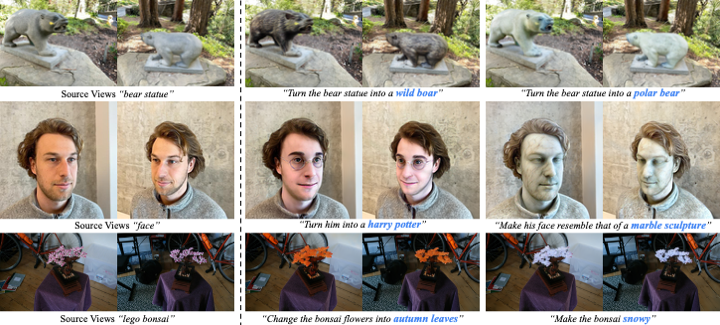
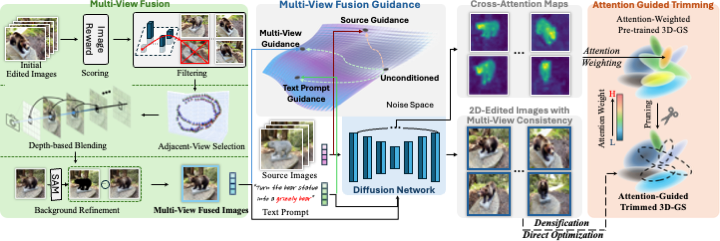

<p align="center">
  <h1 align="center"><strong>[CVPR 2025] EditSplat: Multi-View Fusion and Attention-Guided Optimization
for View-Consistent 3D Scene Editing with 3D Gaussian Splatting</strong></h1>
</p>


<p align="center">
  Dong In Lee<sup>1</sup>, Hyeongcheol Park<sup>1</sup>, Jiyoung Seo<sup>1</sup>, Eunbyung Park<sup>2</sup>,<br>
  Hyunje Park<sup>1</sup>, Ha Dam Baek<sup>1</sup>, Sangheon Shin<sup>3</sup>, Sangmin Kim<sup>3</sup>, Sangpil Kim<sup>1†</sup><br><br>
  <sup>1</sup>Korea University, &nbsp; <sup>2</sup>Yonsei University, &nbsp; <sup>3</sup>Hanwha Systems
</p>


<div align="center">
  <a href="https://arxiv.org/abs/2412.11520">
    
  </a>
  <a href="https://kuai-lab.github.io/editsplat2024/">
    
  </a>
</div>


<p align="center">
  
</p>


## **⚙️ Installation**

Tested on Ubuntu 22.04 + CUDA 11.8 + Python 3.9 (RTX A6000 / RTX 3090).

> **Note**: The GPU memory requirement depends on your dataset size.

```bash
conda env create -f environment.yaml
conda activate editsplat
```

## **📂 Dataset**

We provide a preprocessed **Face** dataset.

- 📥 Download here: [Drive Link](https://drive.google.com/drive/folders/1zpkYAJsJxcs13J0bZa-jThuiWgStdpWX?usp=sharing)

After downloading, move the dataset into the cvpr25_EditSplat/dataset/ directory.

If you want to edit your own dataset, you must first pre-train a 3D Gaussian Splatting (3DGS) model from your custom dataset using COLMAP for camera poses.

> *We are planning to release more datasets with detailed instructions soon — stay tuned!*

## **🎨 Editing**

<p align="center">
  
</p>

To run the editing pipeline:

```bash
./script/editing_face_to_marble_sculpture.sh
```

The edited 3D Gaussian Splatting outputs will be saved under `cvpr25_EditSplat/output`.

You can render custom novel views from the updated 3D scene stored in `cvpr25_EditSplat/output/point_cloud/`.


<details>
<summary><strong>💻 Command Line Arguments for editing</strong></summary>


  ```python
python run_editing.py -s ./dataset/face -m output/face_to_marble_sculpture --source_checkpoint ./dataset/face/chkpnt30000.pth --object_prompt "face" --target_prompt "Make his face resemble that of a marble sculpture" --sampling_prompt "a photo of a marble sculpture" --target_mask_prompt "face"
  ```

  #### --source_path / -s

  Path to the source directory containing a COLMAP.

  #### --source_checkpoint

  Path to the pretrained 3D Gaussian Splatting (3DGS) checkpoint (.pth) you wish to edit.
  Example: ./dataset/<scene_name>/chkpnt30000.pth

  #### --model_path / -m

  Path where the edited model should be stored (output/<random> by default).

  #### --target_prompt

  A text instruction describing the desired edit, written in the format compatible with InstructPix2Pix.

  #### --object_prompt

  The object keyword contained in the `target_prompt`.
  This is used in Attention-Guided Trimming (AGT) to extract cross-attention maps from the diffusion model and assign them to the pretrained 3DGS for local editing and pruning.

  #### --sampling_prompt

  A sentence that describes the expected result after editing.
  The ImageReward model uses this prompt to rank the initially edited images and filter out the bottom 15% with the lowest scores before projection.

  #### --target_mask_prompt

  An object class name (e.g., “marble sculpture”, “wildboar”) representing the expected object after editing.
  Used in Multi-View Fusion Guidance (MFG) to generate a segmentation mask via the SAM model.
  It doesn’t need to appear in the target_prompt. The mask guides background replacement with content from the source dataset.

  #### --iteration

  Number of total iterations to edit for, 30_000 by default.

  #### --eval

  Add this flag to use a MipNeRF360-style training/test split for evaluation.

  Note that, similar to other baselines, we use images with a resolution of 512×512, as required by the InstructPix2Pix model.
</details>

To produce your own edited results, you can maximize performance by tuning the following hyperparameters. Defaults are set according to those used in the main paper.

<details>
<summary><strong>🛠️ Hyperparameter Details</strong></summary>


  #### --epoch

  Number of epochs to optimize the edited 3D Gaussian Splatting.
  Default: 10

  ### AGT (Attention-Guided Trimming)

  #### --attn_thres

  Cross-attention threshold `w_thres`.
  *A higher value leads to tighter localization but may overly restrict the editable region.*
  Default: 0.1

  #### --k_percent

  Pruning proportion `k` for the first densification step.
  *A high value may remove too many Gaussians, degrading editing quality.*
  Default: 0.15

  ### MFG (Multi-View Fusion Guidance)

  #### --text_guidance_scale

  Weight `sT` for the text guidance in the diffusion model.
  *Higher values enforce stronger adherence to the instruction prompt.*
  Default: 7.5

  #### --MFG_scale

  Weight `sM` for the multi-view fusion guidance.
  *Controls the contribution of multi-view information (`hM`) in the editing.*
  Default: 1.0

  #### --source_guidance_scale

  Weight `sS` for the original source image guidance.
  *Helps preserve original source information in editing.*
  Default: 0.5

  #### --filtering_ratio

  Filters out the bottom (1 - filtering_ratio)% of initial edited views based on ImageReward scores, before projection in MFG.
  Default: 0.15

  ### Advanced Tuning

  For additional 3DGS-specific hyperparameters such as `feature_lr`, `opacity_lr`, `scaling_lr`, `rotation_lr`, etc.

  please refer to the official [3D Gaussian Splatting](https://github.com/graphdeco-inria/gaussian-splatting) repository.
</details>

## **📜 Citation**

If you find our work useful, please consider citing:

```tex
@article{lee2024editsplat,
  title={EditSplat: Multi-View Fusion and Attention-Guided Optimization for View-Consistent 3D Scene Editing with 3D Gaussian Splatting},
  author={Dong In Lee and Hyeongcheol Park and Jiyoung Seo and Eunbyung Park and Hyunje Park and Ha Dam Baek and Sangheon Shin and Sangmin Kim and Sangpil Kim},
  journal={arXiv preprint arXiv:2412.11520},
  year={2024},
}
```